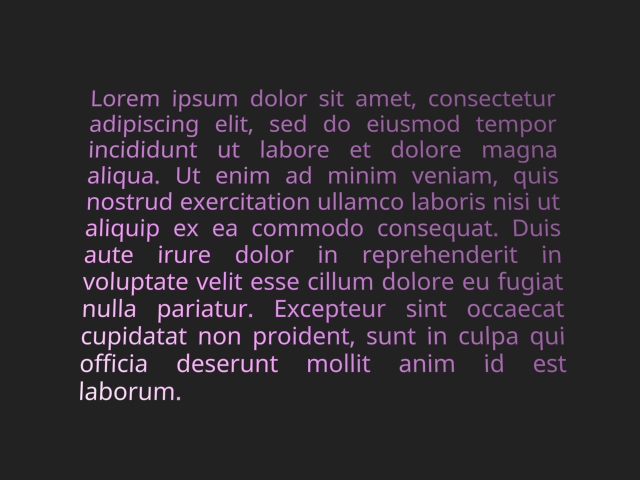
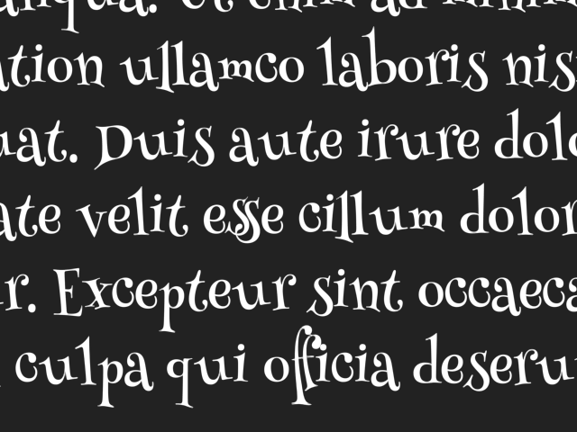
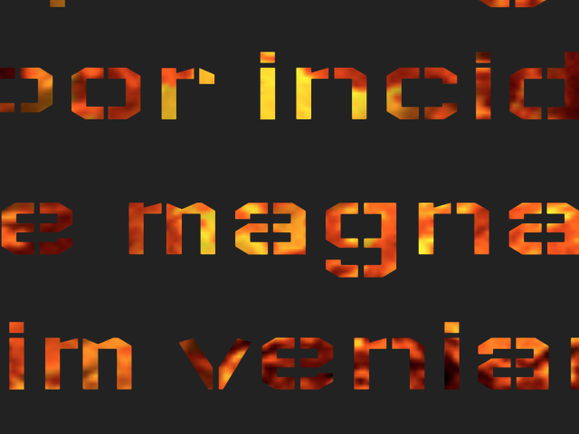

# `troika-3d-text`

This package provides high quality text rendering in 3D scenes, using signed distance fields (SDF) and antialiasing using standard derivatives.

Rather than relying on pre-generated SDF textures, this parses font files (.ttf, .otf, .woff) directly using [Typr.js](https://github.com/photopea/Typr.js), and generates the SDF atlas for glyphs on-the-fly as they are used. It also handles proper kerning and ligature glyph substitution. All font parsing, SDF generation, and glyph layout is performed in a web worker to prevent frame drops. 

Once the SDFs are generated, it assembles a geometry that positions all the glyphs, and _patches_ any Three.js Material with the proper shader code for rendering the SDFs. This means you can still benefit from all the features of Three.js's built-in materials like lighting, physically-based rendering, shadows, and fog.

## Demo

Here's [an online demo](https://troika-examples.netlify.com/#text).

## Screenshots







 

## Usage

### Using within the Troika 3D framework

This library is built first and foremost to work within Troika 3D scenes, via the `Text3DFacade` class.

```js
import {Text3DFacade} from 'troika-3d-text'
```

...then within your scene descriptor:

```js
{
  key: 'my-text',
  facade: Text3DFacade,
  text: 'Hello world!',
  fontSize: 0.2,
  color: 0x9966FF,
  z: -2
  // ...etc.
}
````

### Using standalone with Three.js

The `Text3DFacade` mentioned above is just a wrapper around a Three.js `TextMesh` object, which you can also use directly outside of the Troika framework. A special build file is provided in the distribution that includes only the necessary dependencies:

```js
import {TextMesh} from 'troika-3d-text/dist/textmesh-standalone.esm.js'
````

You can then use the `TextMesh` class like any other Three.js mesh:

```js
const textMesh = new TextMesh()
myScene.add(textMesh)

// set properties to configure:
textMesh.text = 'Hello world!'
textMesh.fontSize = 0.2
textMesh.position.z = -2
textMesh.color = 0x9966FF

// be sure to call sync() after all properties are set to update the rendering:
textMesh.sync()
```

When you're done with the `TextMesh` instance, be sure to call `dispose` on it to prevent a memory leak:

```js
myScene.remove(textMesh)
textMesh.dispose()
```

### Using in other frameworks

Some examples of using the standalone TextMesh within other frameworks:

* [With react-three-fiber](https://codesandbox.io/embed/troika-3d-text-via-react-three-fiber-ntfx2?fontsize=14)
* [As an A-Frame component](https://github.com/lojjic/aframe-troika-text)

## Supported properties

Both `Text3DFacade` and `TextMesh` support the following properties for controlling the text rendering:

#### `text`
  
The string of text to be rendered. Newlines and repeating whitespace characters are honored.

Default: _none_

#### `anchor`

Defines what position within the text block should correspond to the local origin, as a set of horizontal and vertical percentages from 0 to 1. A value of `[0, 0]` anchors at the block's top-left, `[1, 1]` at its bottom-right, and `[0.5, 0.5]` centers the block on the origin.

Default: `[0, 0]`

#### `clipRect`

If specified, defines the `[minX, minY, maxX, maxY]` of a rectangle outside of which all pixels will be discarded. This can be used for example to clip overflowing text when `whiteSpace='nowrap'`.

Default: _none_

#### `color`

This is a shortcut for setting the `color` of the text's `material`. You can use this if you don't want to specify a whole custom `material` and just want to change its color.

Use the `material` property if you want to control aspects of the material other than its color.

Default: _none_ - uses the color of the `material`

#### `font`

The URL of a custom font file to be used. Supported font formats are:
* .ttf
* .otf
* .woff (.woff2 is _not_ supported)

Default: The *Roboto* font loaded from Google Fonts CDN

#### `fontSize`

The em-height at which to render the font, in local world units.

Default: `0.1`

#### `letterSpacing`

Sets a uniform adjustment to spacing between letters after kerning is applied, in local world units. Positive numbers increase spacing and negative numbers decrease it.

Default: `0`

#### `lineHeight`

Sets the height of each line of text. Can either be `'normal'` which chooses a reasonable height based on the chosen font's ascender/descender metrics, or a number that is interpreted as a multiple of the `fontSize`.

Default: `'normal'`

#### `material`

Defines a Three.js Material _instance_ to be used as a base when rendering the text. This material will be automatically replaced with a new material derived from it, that adds shader code to decrease the alpha for each fragment (pixel) outside the text glyphs, with antialiasing.

By default it will derive from a simple white `MeshBasicMaterial, but you can use any of the other mesh materials to gain other features like lighting, texture maps, etc.

Also see the `color` shortcut property.

Default: a `MeshBasicMaterial` instance

#### `maxWidth`

The maximum width of the text block, above which text may start wrapping according to the `whiteSpace` and `overflowWrap` properties.

Default: `Infinity`, meaning text will never wrap

#### `overflowWrap`

Defines how text wraps if the `whiteSpace` property is `'normal'`. Can be either `'normal'` to break at whitespace characters, or `'break-word'` to allow breaking within words.

Default: `'normal'`
     
#### `textAlign`

The horizontal alignment of each line of text within the overall text bounding box. Can be one of `'left'`, `'right'`, `'center'`, or `'justify'`.

Default: `'left'`

#### `whiteSpace`

Defines whether text should wrap when a line reaches the `maxWidth`. Can be either `'normal'`, to allow wrapping according to the `overflowWrap` property, or `'nowrap'` to prevent wrapping. 

Note that `'normal'` in this context _does_ honor newline characters to manually break lines, making it behave more like `'pre-wrap'` does in CSS.

Default: `'normal'`

